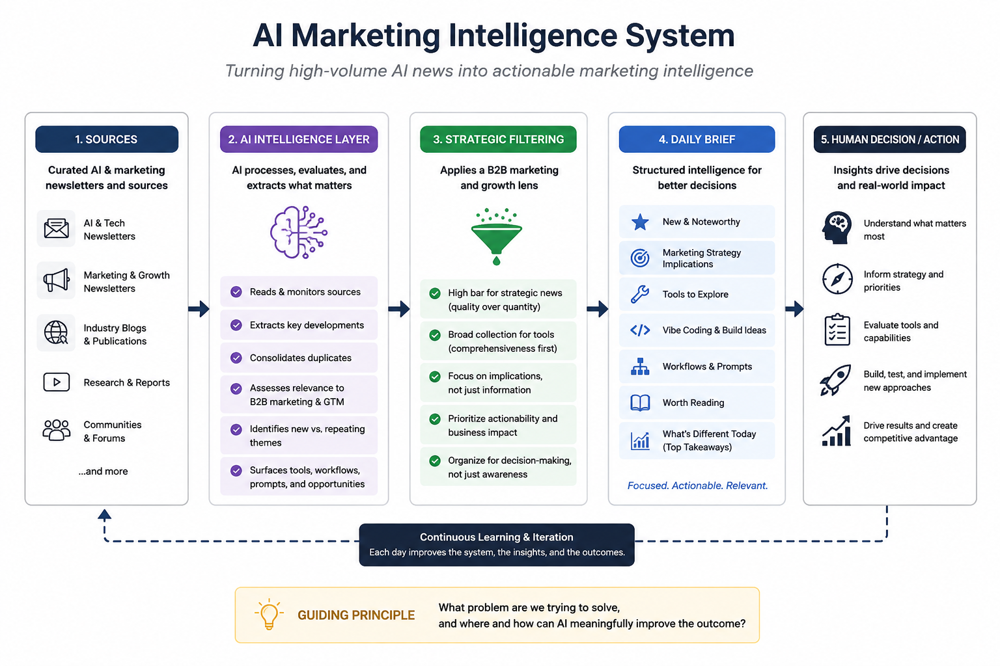

# ai-marketing-intelligence
An AI-enabled system for turning high-volume AI news into actionable marketing intelligence.
AI is evolving faster than most marketing teams can reasonably track. The challenge isn't access to information — it's determining what matters, what's actually new, and where emerging capabilities can create business value.

I built an AI-enabled intelligence system to turn a growing stream of AI and marketing newsletters into a focused daily briefing for marketing decision-making.

The Problem

AI newsletters are useful individually, but consuming them at scale creates several challenges:

The same development is often covered by multiple sources.
Important marketing implications can be buried inside broader AI news.
New tools appear constantly, making it difficult to distinguish useful capabilities from noise.
Interesting developments don't automatically translate into practical marketing applications.
Reading and evaluating everything manually takes significant time.

A conventional newsletter summary would solve the reading problem, but not the decision-making problem.

The goal was to create an intelligence layer between the information and the marketer.

The Approach

The system reviews a defined set of AI and marketing newsletters and evaluates the content through a B2B marketing and growth lens.

Rather than simply summarizing each newsletter, it:

Identifies developments relevant to marketing, sales, and GTM.
Consolidates duplicate coverage across sources.
Distinguishes genuinely new developments from evolving or repeated themes.
Surfaces strategic implications rather than just reporting what happened.
Identifies AI tools with practical marketing or sales applications.
Captures useful workflows, prompts, and emerging techniques.
Identifies opportunities to build new marketing capabilities using AI and vibe coding.

The result is a daily intelligence brief designed around decisions and applications rather than information volume.

Intelligence Framework

The briefing organizes findings into several areas:

New & Noteworthy

Developments that materially change what marketers can do or should be thinking about.

Marketing Strategy

Emerging implications for GTM, demand generation, ABM, positioning, product marketing, customer experience, and growth.

Tools to Explore

AI tools with credible marketing or sales applications, including:

Customer, market, and competitive intelligence
Content and social
Video, image, and audio production
SEO, AEO, and GEO
Advertising and campaign optimization
Analytics and measurement
Lead generation and sales outreach
Website conversion
Lifecycle marketing
Knowledge management
Agents and automation
Vibe coding and application development
Vibe Coding & Build Ideas

Opportunities to create useful marketing capabilities rather than waiting for an off-the-shelf product.

Workflows & Prompts

Repeatable approaches that can improve marketing execution or decision-making.

Worth Reading

High-value source material worth spending additional time on.

What's Different Today

A synthesis layer designed to answer the most important question:

What changed that I should actually care about?

Human Judgment Is Part of the System

One of the most important lessons came from the first version.

The initial brief successfully reduced information volume and surfaced high-signal developments. But in optimizing for signal, it became too selective in one area: tools.

Useful marketing and sales tools were being excluded because they weren't individually important enough to qualify as major AI developments.

That revealed an important distinction:

Different types of intelligence require different filtering thresholds.

Strategic news benefits from aggressive filtering. Tool discovery benefits from broader collection followed by human evaluation.

The system was redesigned accordingly:

Editorial intelligence remains highly selective.
Tool discovery is deliberately more comprehensive.

This improved the usefulness of the output without turning the overall brief into another high-volume information feed.

Design Principle

The system reflects a broader principle I use when applying AI:

Start with the business problem, not the technology.

The objective wasn't to automate newsletter reading.

It was to improve the ability to recognize meaningful change, identify opportunities, and make better marketing decisions without increasing the amount of information a leader has to consume.

The question behind each iteration remains:

What problem are we trying to solve, and where and how can AI meaningfully improve the outcome?

What's Next

The system will continue to evolve as new patterns emerge.

Areas I'm exploring include:

Building a persistent intelligence library across daily briefs
Tracking tools and capabilities over time rather than rediscovering them
Identifying emerging themes before they become established marketing practices
Connecting developments to specific GTM and business use cases
Creating deeper evaluation criteria for when a new AI capability is worth adopting
Turning recurring insights into new workflows, agents, and marketing capabilities

This repository documents the system design and learning process. Examples are intentionally focused on methodology rather than private email content or proprietary company information.
